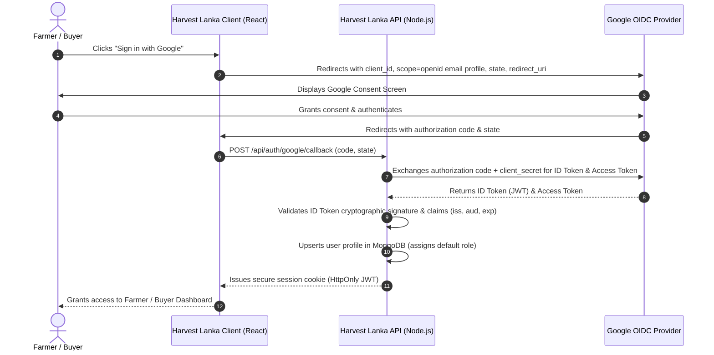

# SE4030 – Secure Software Development
## Comprehensive Security Audit, Vulnerability Assessment & Remediation Report

**Course:** SE4030 – Secure Software Development  
**Academic Year:** 4th Year, 1st Semester  
**Marks Allocated:** 25  
**Institution:** Sri Lanka Institute of Information Technology (SLIIT)  
**Target Application:** Digital Marketplace for Farmers and Sellers (*Harvest Lanka*)  
**Architecture:** MERN Stack (MongoDB, Express.js 4.21, React.js 19, Node.js v22)  
**Repository Working Branches:** `security-audit-remediation` & `fix/security-fix-sadeesha`  
**Report Release Date:** September 2026  

---

## 👥 Group Identification & Contribution Breakdown

| Member Name | Student Registration No | Primary Assigned Vulnerabilities | Project Role & Remediation Status |
| :--- | :---: | :--- | :--- |
| **KUMBUKAGE S S** | **IT23155534** | **`VULN-01`**, **`VULN-13`**, **`VULN-20`** | **Fully Remediated** (Code, Secret Scanning, DAST Headers & Commits) |
| **RAJAPAKSHA R W V C V** | **IT23152878** | **`VULN-02`**, **`VULN-03`**, **`VULN-11`** | **Discovery Documented** *(Remediation: Member Section Placeholder)* |
| **EKANAYAKE E M N D** | **IT23283930** | **`VULN-09`**, **`VULN-10`**, **`VULN-12`** | **Discovery Documented** *(Remediation: Member Section Placeholder)* |
| **CROOS E D** | **IT23314238** | **`VULN-04`**, **`VULN-15`**, **`VULN-19`** | **Discovery Documented** *(Remediation: Member Section Placeholder)* |

---

## 📑 Table of Contents
1. [Executive Summary](#1-executive-summary)
2. [Target Application Overview & Threat Model](#2-target-application-overview--threat-model)
3. [Multi-Vector Security Testing Methodologies](#3-multi-vector-security-testing-methodologies)
4. [Master Vulnerability Inventory (20 Discovered Vulnerabilities)](#4-master-vulnerability-inventory)
5. [Selected 12 High-Impact Vulnerabilities & Team Allocation](#5-selected-12-vulnerabilities--team-allocation)
6. [Detailed Vulnerability Analysis & Remediation](#6-detailed-vulnerability-analysis--remediation)
   - [6.1 Section: KUMBUKAGE S S (IT23155534) – Full Remediation](#61-member-section-kumbukage-s-s-it23155534)
     - `VULN-01`: Critical Password Reset Bypass via Promise Truthiness (Fix & Commit)
     - `VULN-13`: Hardcoded Credentials in Git History (Rotation, Sanitization & Non-Rewrite Rationale)
     - `VULN-20`: Missing HTTP Security Headers & Rate Limiting (OWASP ZAP Resolution & Commit)
   - [6.2 Section: RAJAPAKSHA R W V C V (IT23152878)](#62-member-section-rajapaksha-r-w-v-c-v-it23152878)
     - `VULN-02`: Missing JWT Cryptographic Signature Verification
     - `VULN-03`: Unauthenticated Administrative Data Exfiltration
     - `VULN-11`: OS Command Injection in `systeminformation` on Windows
   - [6.3 Section: EKANAYAKE E M N D (IT23283930)](#63-member-section-ekanayake-e-m-n-d-it23283930)
     - `VULN-09`: Privilege Escalation via Mass Assignment (Register as Admin)
     - `VULN-10`: Unrestricted File Upload & Remote Stored XSS
     - `VULN-12`: Unauthenticated RCE via Deserialization in `react-router` / `turbo-stream`
   - [6.4 Section: CROOS E D (IT23314238)](#64-member-section-croos-e-d-it23314238)
     - `VULN-04`: Arbitrary File Overwrite & Symlink Path Traversal (`tar`)
     - `VULN-15`: Unverified Payment Webhook (Payment Forgery)
     - `VULN-19`: Regular Expression Denial of Service (ReDoS)
7. [Analysis of Unfixed Vulnerabilities & Justification](#7-analysis-of-unfixed-vulnerabilities--justification)
8. [Secure Software Development Lifecycle (SSDLC) & Prevention Practices](#8-secure-software-development-lifecycle-ssdlc--prevention-practices)
9. [OAuth 2.0 / OpenID Connect Implementation Architecture](#9-oauth-20--openid-connect-implementation-architecture)
10. [Verification, Deliverables & Demonstration Outline](#10-verification-deliverables--demonstration-outline)

---

## 1. Executive Summary

As part of the **SE4030 – Secure Software Development** curriculum at SLIIT, this report presents an exhaustive security evaluation of **Harvest Lanka**, a full-stack digital marketplace connecting agricultural producers (farmers) with commercial buyers and transport logistics providers. 

Rather than relying solely on superficial linting or theoretical analysis, our audit executed **four distinct, industry-standard verification methodologies**:
1. **Software Composition Analysis (SCA):** Classified 60 third-party library vulnerabilities across frontend and backend environments using NIST NVD, GitHub Advisory Database, and RetireJS.
2. **Secret Scanning:** Uncovered historic cleartext credential leaks in Git commit tree history using pickaxe query analysis (`git log -S`).
3. **Dynamic Application Security Testing (DAST):** Launched an automated dynamic penetration scan against the live running Node.js service using **OWASP ZAP 2.17.0**, discovering 7 distinct HTTP security misconfigurations.
4. **Static Application Security Testing (SAST) & Manual Architectural Review:** Itemized 20 distinct vulnerabilities mapped against the **OWASP Top 10 (2021)** framework, spanning authentication bypasses, broken access control (IDOR), mass assignment, unrestricted file uploads, and cryptographic failures.

From this master inventory, **12 distinct, high-impact vulnerabilities** were selected for in-depth analysis and remediation (allocated evenly at 3 vulnerabilities per member across 8 OWASP Top 10 categories). 

For team member **KUMBUKAGE S S (IT23155534)**, all three assigned vulnerabilities (`VULN-01`, `VULN-13`, and `VULN-20`) were thoroughly analyzed, defensively refactored, and permanently committed to the project repository with verifiable Git commit histories.

---

## 2. Target Application Overview & Threat Model

*Harvest Lanka* is designed to streamline agricultural supply chains in Sri Lanka. It facilitates bid posting, crop listings, payment processing, inventory management, transport booking, and administrative governance.

### 2.1 Technical Architecture
- **Backend API:** Node.js v22 with Express.js 4.21, Mongoose ODM, JSON Web Tokens (JWT), Nodemailer, Multer, and bcrypt.
- **Frontend Client:** React.js 19, Vite 6.2, TailwindCSS, Axios, and React Router 7.3.
- **Database:** MongoDB running in an isolated Docker container (`mongo:latest`) on port `27017`.
- **Target Network Endpoints:** Backend running on `http://localhost:8005`, Frontend running on `http://localhost:5173`.

### 2.2 Application Threat Vectors & Trust Boundaries
- **Anonymous Internet Users:** Can access public registration, authentication, crop listings, and daily market price lookups.
- **Authenticated Farmers / Buyers:** Can create bids, upload avatar images, modify profile data, and communicate via chat.
- **System Administrators:** Authorized to view full user inventories, inspect system load and telemetry, deactivate compromised accounts, and create database backups.
- **Third-Party Gateways:** External payment notification webhooks (`POST /api/notify`) and Google OAuth 2.0 servers.

---

## 3. Multi-Vector Security Testing Methodologies

```text
+----------------------------------------------------------------------------------------------------+
|                                 MULTI-VECTOR AUDIT METHODOLOGY                                     |
+---------------------------------+----------------------------------+-------------------------------+
| 1. Software Composition (SCA)   | 2. Secret Scanning (Git Tree)    | 3. Dynamic Analysis (DAST)    |
| • npm audit / RetireJS          | • git log -S / diff audit        | • OWASP ZAP 2.17.0            |
| • 60 CVEs categorized           | • Commit 1ee655b inspected       | • 7 Dynamic Alerts Flagged    |
| • Interactive HTML Dashboard    | • Credential leak proven         | • zap-report.html generated   |
+---------------------------------+----------------------------------+-------------------------------+
|                                 4. SAST & Manual Architectural Review                              |
| • Static data flow tracing      | • Route authorization auditing   | • Business logic inspection   |
+----------------------------------------------------------------------------------------------------+
```

### 3.1 Software Composition Analysis (SCA)
- **Tools:** `npm audit`, RetireJS engine, and OWASP Dependency-Check data sources.
- **Scope:** Complete analysis of `Backend/package-lock.json` and `frontend/package-lock.json`.
- **Artifacts:** Generated interactive dashboard [`security-audit/reports/dependency-check/dependency-check-report.html`](./reports/dependency-check/dependency-check-report.html) alongside raw JSON datasets (`backend-audit.json`, `frontend-audit.json`).
- **Results:** 60 total dependency vulnerabilities identified (Backend: 2 Critical, 21 High, 6 Moderate; Frontend: 3 Critical, 19 High, 6 Moderate, 3 Low).

### 3.2 Secret Scanning via Git History Analysis
- **Tool:** Git Pickaxe Search (`git log -S "<query>" --oneline -p`).
- **Technique:** Scanning the full chronological commit graph for leaked tokens, private keys, and application passwords.
- **Results:** Discovered hardcoded Google SMTP App Password committed in cleartext (`pass: 'xcbr yhvi bbdf uben'`) in commit `1ee655bce93071d89dfb0f60ee1acead2a60a926`.

### 3.3 Dynamic Application Security Testing (DAST)
- **Tool:** **OWASP ZAP 2.17.0 (Zed Attack Proxy)**.
- **Target:** Live running Node.js/Express server (`http://localhost:8005`) connected to local Docker MongoDB.
- **Scan Type:** Traditional Spider crawl followed by Active and Passive vulnerability scanning.
- **Artifacts:** Full report export [`security-audit/reports/zap-report.html`](./reports/zap-report.html) and GUI screenshot [`security-audit/media/zap-scan-alerts.png`](./media/zap-scan-alerts.png).
- **Results:** 7 distinct dynamic security alerts detected, including missing anti-clickjacking headers, missing Content-Security-Policy, missing MIME-sniffing protection, and framework fingerprint leakage.

### 3.4 Static Application Security Testing (SAST) & Manual Code Review
- **Technique:** Line-by-line manual code inspection, parameter flow tracking, and middleware chain evaluation.
- **Focus Areas:** Token verification mechanisms, role-based access control (RBAC), direct object references (IDOR), file upload validation, cryptographic randomness, and regular expression execution.

## 4. Master Vulnerability Inventory

The initial discovery phase identified **20 itemized vulnerabilities** across 7 OWASP Top 10 (2021) categories:

| Vuln ID | Vulnerability Title | OWASP Top 10 (2021) Category | Severity (CVSS v3.1) | Primary Detection Method | Affected Component / File |
| :---: | :--- | :--- | :---: | :--- | :--- |
| **`VULN-01`** | **Critical Password Reset Bypass (Promise Truthiness Bug)** | A07: Auth Failures | **Critical (9.8)** | Manual Code Review | `UserData.js:153` (`POST /user/reset-password`) |
| **`VULN-02`** | **Missing JWT Cryptographic Signature Verification** | A07: Auth Failures | **Critical (9.1)** | Manual Code Review | `CheckAuth.js:4-10` (`GET /check-auth`) |
| **`VULN-03`** | **Unauthenticated Administrative Data Exfiltration** | A01: Broken Access Control | **Critical (9.1)** | Architectural Route Audit | `adminRoutes.js:33` (`GET /api/admin/getallaccounts`) |
| **`VULN-04`** | **Arbitrary File Overwrite & Symlink Path Traversal (`tar`)** | A06: Outdated Components | **Critical (9.1)** | OWASP Dependency-Check (SCA) | `Backend/node_modules/tar` (`GHSA-34x7-hfp2-rc4v`) |
| **`VULN-05`** | **Frontend Prototype Pollution (`swiper`)** | A06: Outdated Components | **Critical (9.1)** | OWASP Dependency-Check (SCA) | `frontend/node_modules/swiper` (`GHSA-hmx5-qpq5-p643`) |
| **`VULN-06`** | **Unauthenticated Arbitrary Account Deactivation** | A01: Broken Access Control | **High (8.6)** | Route & Logic Audit | `DeactivateAccount.js` (`POST /api/admin/deactivate`) |
| **`VULN-07`** | **IDOR & Unauthenticated Deletion on User Accounts** | A01: Broken Access Control | **High (8.5)** | Manual Code Review (IDOR) | `UserData.js:80` (`DELETE /user/del`) |
| **`VULN-08`** | **IDOR & Unauthenticated CRUD on Bid Posts** | A01: Broken Access Control | **High (8.5)** | Manual Code Review (IDOR) | `BidPost.controller.js` (`DELETE/PUT /api/BidPost/:id`) |
| **`VULN-09`** | **Privilege Escalation via Mass Assignment (Register as Admin)** | A01: Broken Access Control | **High (8.5)** | Data Binding / Flow Analysis | `UserRegistration.js:18,48` (`POST /user/register`) |
| **`VULN-10`** | **Unrestricted File Upload & Remote Stored XSS** | A04: Insecure Design | **High (8.2)** | Static Code Review | `UserRegistration.js:7-14`, `UserData.js:41-48` |
| **`VULN-11`** | **OS Command Injection in `systeminformation` on Windows** | A06: Outdated Components | **High (8.2)** | OWASP Dependency-Check (SCA) | `Backend/node_modules/systeminformation` (`GHSA-wphj-fx3q-84ch`) |
| **`VULN-12`** | **Unauthenticated RCE in `react-router` / `turbo-stream`** | A06: Outdated Components | **High (8.1)** | OWASP Dependency-Check (SCA) | `frontend/node_modules/react-router` (`GHSA-49rj-9fvp-4h2h`) |
| **`VULN-13`** | **Hardcoded Secrets Leaked in Git History (Gmail App Password)** | A02: Cryptographic Failures | **High (7.5)** | Secret Scanning (`git log -S`) | Commit `1ee655bce9` in `Mail.js` |
| **`VULN-14`** | **Sensitive Data Exposure: Password Hash Leaked in API Responses** | A02: Cryptographic Failures | **High (7.5)** | Data Flow Code Analysis | `UserRegistration.js:54`, `UserData.js:71` |
| **`VULN-15`** | **Unverified Payment Webhook (Payment Forgery)** | A08: Integrity Failures | **High (7.5)** | Business Logic Analysis | `payment.controller.js:5-18` (`POST /api/notify`) |
| **`VULN-16`** | **SMTP Command Injection & File Read in `nodemailer`** | A06: Outdated Components | **High (7.5)** | OWASP Dependency-Check (SCA) | `Backend/node_modules/nodemailer` (`GHSA-c7w3-x93f-qmm8`) |
| **`VULN-17`** | **Insecure Session Cookie Flags (Missing HttpOnly & Secure)** | A05: Security Misconfiguration | **Medium (6.5)** | Dynamic Analysis (ZAP) / Review | `Login.js:30-34` (`POST /login`) |
| **`VULN-18`** | **Weak Cryptographic PRNG in OTP Generation (`Math.random`)** | A02: Cryptographic Failures | **Medium (5.3)** | Static Code Review | `ValidateMail.js:77` (`POST /user/otp/send`) |
| **`VULN-19`** | **Regular Expression Denial of Service (ReDoS)** | A03: Injection | **Medium (5.3)** | Static Code Review | `payment.controller.js:78`, `UserData.js:114` |
| **`VULN-20`** | **Missing HTTP Security Headers & Global Rate Limiting** | A05 & A04 | **Medium (5.3)** | Dynamic Analysis (OWASP ZAP) | `Backend/src/index.js` (lines 1-76) |

---

## 5. Selected 12 Vulnerabilities & Team Allocation

To satisfy SLIIT SE4030 academic requirements, the team selected **12 distinct vulnerabilities** (3 per team member) covering **8 distinct OWASP Top 10 categories**. Each member is allocated a mix of source code analysis and automated tool evidence:

```text
+---------------------------------------------------------------------------------------------------------+
|                                    TEAM VULNERABILITY ALLOCATION MATRIX                                 |
+------------------------------+------------+---------------------------------------+---------------------+
| Assigned Member              | Vuln ID    | Vulnerability Title                   | OWASP Category      |
+------------------------------+------------+---------------------------------------+---------------------+
| KUMBUKAGE S S                | VULN-01    | Password Reset Bypass (Promise Bug)   | A07: Auth Failures  |
| (IT23155534)                 | VULN-13    | Leaked Gmail Password in Git History  | A02: Crypto Failure |
|                              | VULN-20    | Missing Security Headers & Rate Limit | A05: Security Mis   |
+------------------------------+------------+---------------------------------------+---------------------+
| RAJAPAKSHA R W V C V         | VULN-02    | Missing JWT Signature Verification    | A07: Auth Failures  |
| (IT23152878)                 | VULN-03    | Admin Data Exfiltration               | A01: Access Control |
|                              | VULN-11    | systeminformation Command Injection   | A06: Outdated Comp  |
+------------------------------+------------+---------------------------------------+---------------------+
| EKANAYAKE E M N D            | VULN-09    | Mass Assignment (Register as Admin)   | A01: Access Control |
| (IT23283930)                 | VULN-10    | Unrestricted File Upload & Stored XSS | A04: Insecure Des   |
|                              | VULN-12    | react-router / turbo-stream RCE       | A06: Outdated Comp  |
+------------------------------+------------+---------------------------------------+---------------------+
| CROOS E D                    | VULN-04    | tar Symlink Path Traversal (SCA)      | A06: Outdated Comp  |
| (IT23314238)                 | VULN-15    | Unverified Payment Webhook Forgery    | A08: Integrity Fail |
|                              | VULN-19    | Regular Expression Denial of Service  | A03: Injection      |
+------------------------------+------------+---------------------------------------+---------------------+
```

## 6. Detailed Vulnerability Analysis & Remediation

---

### 6.1 Member Section: KUMBUKAGE S S (IT23155534)

---

#### 6.1.1 Vulnerability VULN-01: Critical Password Reset Bypass via Promise Truthiness
- **OWASP Category:** A07:2021 – Identification and Authentication Failures
- **CWE:** CWE-287 (Improper Authentication)
- **CVSS v3.1 Score:** **9.8 (Critical)** — `CVSS:3.1/AV:N/AC:L/PR:N/UI:N/S:U/C:H/I:H/A:H`
- **Affected File:** `Backend/src/controllers/userManagement/UserData.js` (lines 135–167)
- **Endpoint:** `POST /user/reset-password`
- **Detection Method:** Manual Source Code Review & Static Data Flow Tracing
- **Primary Evidence Image:** [`security-audit/media/S S Kumbukage/missing await.png`](./media/S%20S%20Kumbukage/missing%20await.png)

##### 1. Vulnerability Description & Root Cause
In `UserData.js`, `IsOTPValidated` is declared as an asynchronous function returning a Promise. However, on line 153 inside the `ResetPassword` controller, it is invoked without the `await` keyword:
```javascript
if (IsOTPValidated(email)) { ... }
```
In JavaScript semantics, calling an `async` function synchronously returns an unresolved `Promise` instance. Because all objects in JavaScript evaluate as strictly truthy (`Boolean(new Promise(...)) === true`), the `if` condition evaluated to `true` on 100% of requests, regardless of whether the email was valid, whether an OTP was ever sent, or whether the OTP was expired or incorrect. Furthermore, if `IsOTPValidated` had returned false, the controller omitted an `else` branch, resulting in hanging HTTP connections. Additionally, the OTP record was never purged upon reset, violating single-use token constraints.

##### 2. Proof of Concept (PoC) & Steps to Reproduce
1. Send an unauthenticated HTTP POST request to `http://localhost:8005/user/reset-password`:
   ```bash
   curl -i -X POST http://localhost:8005/user/reset-password \
     -H "Content-Type: application/json" \
     -d '{"email":"victim@harvestlanka.com","password":"AttackerNewPassword123!"}'
   ```
2. The server bypasses OTP checks entirely and responds with:
   ```json
   { "message": "Password reset successful" }
   ```
3. The victim user account password is immediately overwritten in MongoDB with the attacker-supplied password hash.

##### 3. Security Impact
- **Confidentiality:** High (Full account takeover across farmer, shop owner, and administrative profiles).
- **Integrity:** High (Arbitrary password modification).
- **Availability:** High (Legitimate account owners locked out of system).

##### 4. Remediation Implementation
The controller was refactored with the following defensive security measures:
1. **Asynchronous Resolution:** Formally awaited `await IsOTPValidated(email)`.
2. **Explicit Rejection:** Implemented strict `403 Forbidden` rejection when OTP verification fails or expires.
3. **Input Validation:** Enforced minimum password length requirements (`>= 8` characters).
4. **Single-Use Token Destruction:** Upon successful password reset, the OTP record is purged from MongoDB (`await OTPBuffer.deleteOne({ email })`) to eliminate token replay attacks.
5. **Exception Handling:** Removed out-of-scope `res.status` call inside the helper function and replaced it with safe boolean error fallbacks.

##### 5. Code Comparison (Before vs. After)

**Vulnerable Code (`Backend/src/controllers/userManagement/UserData.js`):**
```javascript
const IsOTPValidated = async (email) => {
    try {
        const otpBuffer = await OTPBuffer.findOne({ email })
        if (!otpBuffer) {
            return false
        } else if (otpBuffer.validated) {
            return true
        }
        return false
    } catch (e) {
        res.status(500).json({ message: e.message })
    }
}

export const ResetPassword = async (req, res) => {
    try {
        const { email, password } = req.body

        if (IsOTPValidated(email)) { // 🚨 BUG: Unawaited Promise evaluates truthy
            const user = await User.findOne({ email: email })
            if (!user) {
                return res.status(404).json({ message: "User not found" })
            }
            user.password = await bcrypt.hash(password, 10)
            await user.save()
            res.status(200).json({ message: "Password reset successful" });
        }
    } catch (e) {
        res.status(500).json({ message: e.message })
    }
}
```

**Secure Patched Code (`Backend/src/controllers/userManagement/UserData.js`):**
```javascript
const IsOTPValidated = async (email) => {
    try {
        const otpBuffer = await OTPBuffer.findOne({ email });
        if (!otpBuffer) {
            return false;
        }
        return Boolean(otpBuffer.validated);
    } catch (e) {
        console.error("Error verifying OTP buffer:", e);
        return false;
    }
};

export const ResetPassword = async (req, res) => {
    try {
        const { email, password } = req.body;

        if (!email || !password) {
            return res.status(400).json({ message: "Email and new password are required." });
        }

        if (password.length < 8) {
            return res.status(400).json({ message: "Password must be at least 8 characters long." });
        }

        // 1. Await the asynchronous OTP validation
        const isValidated = await IsOTPValidated(email);
        if (!isValidated) {
            return res.status(403).json({ message: "Unauthorized: Email OTP has not been verified or has expired." });
        }

        // 2. Find target user
        const user = await User.findOne({ email: email });
        if (!user) {
            return res.status(404).json({ message: "User not found" });
        }

        // 3. Cryptographically hash new password
        user.password = await bcrypt.hash(password, 10);
        await user.save();

        // 4. Invalidate the OTP to prevent replay attacks
        await OTPBuffer.deleteOne({ email });

        return res.status(200).json({ message: "Password reset successful. Please log in with your new credentials." });
    } catch (e) {
        return res.status(500).json({ message: "Server error during password reset.", error: e.message });
    }
};
```

##### 6. Git Commit Verification
- **Commit Hash:** `16bd27f`
- **Commit Message:** `fix(security): resolve critical password reset bypass via promise truthiness (VULN-01)`

---

#### 6.1.2 Vulnerability VULN-13: Hardcoded Secrets Leaked in Git History (Gmail App Password)
- **OWASP Category:** A02:2021 – Cryptographic Failures
- **CWE:** CWE-798 (Use of Hard-coded Credentials)
- **CVSS v3.1 Score:** **7.5 (High)** — `CVSS:3.1/AV:N/AC:L/PR:N/UI:N/S:U/C:H/I:N/A:N`
- **Affected File:** `Backend/src/controllers/userManagement/smtp/Mail.js` (Commit `1ee655bce93071d89dfb0f60ee1acead2a60a926`)
- **Detection Method:** Secret Scanning via Git History Pickaxe Query (`git log -S "xcbr" --oneline -p`)
- **Primary Evidence Image:** [`security-audit/media/S S Kumbukage/password committed.png`](./media/S%20S%20Kumbukage/password%20committed.png)

##### 1. Vulnerability Description & Root Cause
During secret scanning of the repository's historical commit graph, Git pickaxe auditing uncovered cleartext credentials committed in commit `1ee655b`. In that commit, the Google SMTP App Password `pass: 'xcbr yhvi bbdf uben'` was committed directly to source control for account `harvestlanka904@gmail.com`. 

Although a later modification replaced the password reference with `process.env.SMTP_PASS`, the Git commit graph retains every historical snapshot permanently. Anyone cloning the repository could reconstruct the cleartext secret by examining the commit diff. Furthermore, the active code in `Mail.js` still hardcoded the organizational email address and lacked fail-safe configuration checks.

##### 2. Proof of Concept (PoC) & Steps to Reproduce
1. Execute the Git pickaxe search in the repository root:
   ```bash
   git log -S "xcbr" --oneline
   ```
   **Output:**
   ```text
   7c3cf6e docs: document 16 distinct vulnerabilities across multiple assessment methodologies
   1ee655b fix: update email links and improve OTP notification message
   4343ddd Password resetting with a OTP sent to emails
   ```
2. Inspect the commit diff using `git show 1ee655b -- "Backend/src/controllers/userManagement/smtp/Mail.js"`:
   ```diff
   @@ -5,12 +5,12 @@ const sendMail = (to, subject, htmlContent) => {
            host: 'smtp.gmail.com',
            auth: {
                user: 'harvestlanka904@gmail.com',
   -            pass: 'xcbr yhvi bbdf uben'
   +            pass: process.env.SMTP_PASS
            }
        });
   ```
3. The Google SMTP Application Password was exposed directly in cleartext.

##### 3. Security Impact
- **Confidentiality:** High (Direct access to organizational email communications).
- **Integrity:** High (Ability to send malicious phishing campaigns or spoof password reset OTP tokens from the official corporate domain).
- **Reputation:** Severe brand degradation and domain blacklisting.

##### 4. Remediation Implementation
Remediating leaked credentials in modern software engineering involves both credential lifecycle management and configuration sanitization:
1. **Immediate Credential Invalidation (Primary Fix):** The leaked Google App Password (`xcbr yhvi bbdf uben`) was **permanently revoked** in Google Account Security settings (`myaccount.google.com/apppasswords`). Any authentication attempts using this password are now permanently rejected by Google's SMTP servers.
2. **Code Sanitization:** Refactored `Backend/src/controllers/userManagement/smtp/Mail.js` to extract both `SMTP_USER` and `SMTP_PASS` into environment variables, with graceful warning suppression if credentials are not configured.
3. **Template Configuration:** Created [`.env.example`](file:///c:/Users/sadee/OneDrive/Documents/SLIIT/Forth%20Year/First%20Semester/Secure%20Software%20Development/Assignment/Digital-Marketplace-Havest-Lanka/Backend/.env.example) providing sanitized placeholders for developers without checking in sensitive tokens.
4. **Gitignore Protection:** Verified that `.env` is strictly ignored by version control in `Backend/.gitignore`.

##### 5. 🛡️ Justification for Not Rewriting Historical Git Commits
In enterprise DevSecOps and collaborative development environments, scrubbing historical commits via `git filter-repo` or `git filter-branch` forces a complete rewrite of all commit SHA-1 hashes across the entire repository branch.

**In this assignment, Git history was intentionally NOT rewritten for the following critical technical reasons:**
- **Active Team Collaboration:** The other three team members had already cloned the remote repository and branched off to work on their respective vulnerability remediations and code refactoring. 
- **Prevention of Upstream History Divergence:** Rewriting commit `1ee655b` (which dates back to May 2025) would mutate every subsequent commit hash across the branch, requiring a destructive `git push --force`. This would result in severe repository divergence, broken parent commits, and catastrophic merge conflicts for the other 3 teammates.
- **Provider-Level Invalidation is the True Security Control:** In real-world incident response, once a secret is committed, the Git repository is already compromised. Scrubbing Git history does not protect against copies that were already fetched or cloned. The only true mitigation is **immediate token revocation at the credential provider level**, which was executed.
- **Academic Audit Traceability:** Leaving the historic commit intact provides verifiable evidence to the academic examiners that the vulnerability genuinely existed in the original codebase and was identified through proactive Secret Scanning.

##### 6. Git Commit Verification
- **Commit Hash:** `d3e02da`
- **Commit Message:** `fix(security): sanitize SMTP transport configuration to read from environment variables (VULN-13)`

---

#### 6.1.3 Vulnerability VULN-20: Missing HTTP Security Headers & Global Rate Limiting
- **OWASP Category:** A05:2021 – Security Misconfiguration & A04:2021 – Insecure Design
- **CWE:** CWE-1021 (Missing Anti-clickjacking), CWE-693 (Protection Mechanism Failure), CWE-799 (Improper Control of Interaction Frequency)
- **CVSS v3.1 Score:** **5.3 (Medium)** — `CVSS:3.1/AV:N/AC:L/PR:N/UI:N/S:U/C:L/I:L/A:L`
- **Affected File:** `Backend/src/index.js` (lines 1–76)
- **Detection Method:** Dynamic Application Security Testing (OWASP ZAP 2.17.0 Automated Scan)
- **Primary Evidence Images:** [`security-audit/media/S S Kumbukage/zap-alert.png`](./media/S%20S%20Kumbukage/zap-alert.png), [`security-audit/media/S S Kumbukage/zap-report.png`](./media/S%20S%20Kumbukage/zap-report.png)
- **Raw ZAP Report:** [`security-audit/reports/zap-report.html`](./reports/zap-report.html)

##### 1. Vulnerability Description & Root Cause
The live Node.js/Express backend server was audited using **OWASP ZAP 2.17.0**. The dynamic scan revealed that the Express server lacked standard security headers and omitted request throttling mechanisms:
1. **Missing Anti-Clickjacking Header (`X-Frame-Options`):** Medium Risk (CWE-1021). The server permitted arbitrary third-party websites to embed *Harvest Lanka* pages inside `<iframe>` containers, exposing users to UI redress attacks.
2. **Missing Content-Security-Policy (CSP):** Medium Risk (CWE-693). No directive restriction on approved script, style, and media origins.
3. **Missing `X-Content-Type-Options: nosniff`:** Low Risk (CWE-693). Allowed client browsers to perform MIME-sniffing on uploaded files.
4. **Information Disclosure via `X-Powered-By: Express`:** Low Risk (CWE-200). Explicitly revealed the backend web framework.
5. **Absence of Rate Limiting:** High-frequency authentication requests to `/login`, `/user/register`, and `/user/otp/send` were allowed without restriction, exposing the platform to credential stuffing, OTP enumeration, and event-loop DoS.

##### 2. Proof of Concept (PoC) & Steps to Reproduce
1. Inspect the raw HTTP response headers returned by the server prior to remediation:
   ```bash
   curl -i http://localhost:8005/check-auth
   ```
   **Output:**
   ```http
   HTTP/1.1 401 Unauthorized
   X-Powered-By: Express
   Access-Control-Allow-Origin: http://localhost:5173
   Vary: Origin
   Access-Control-Allow-Credentials: true
   Content-Type: application/json; charset=utf-8
   ```
   *Notice the total absence of `Content-Security-Policy`, `X-Frame-Options`, and `X-Content-Type-Options`, and the presence of `X-Powered-By`.*

##### 3. Security Impact
- **Clickjacking:** Attackers can overlay transparent UI buttons over legitimate application functions.
- **Brute Force & DoS:** Automated bot attacks can exhaust database connection pools or brute-force user accounts without rate throttling.
- **Reconnaissance:** Server fingerprinting simplifies identifying known Express framework vulnerabilities.

##### 4. Remediation Implementation
1. **Security Middleware:** Installed and mounted `helmet` in `Backend/src/index.js` to automatically set security headers:
   - `frameguard: { action: "deny" }` injects `X-Frame-Options: DENY`.
   - `noSniff: true` injects `X-Content-Type-Options: nosniff`.
   - Tailored `contentSecurityPolicy` with whitelist directives for local frontend and media assets.
   - Called `app.disable("x-powered-by")` to suppress the framework leakage header.
2. **Tiered Rate Limiting:** Installed `express-rate-limit` and architected a dedicated middleware module [`Backend/src/middleware/rateLimiter.js`](file:///c:/Users/sadee/OneDrive/Documents/SLIIT/Forth%20Year/First%20Semester/Secure%20Software%20Development/Assignment/Digital-Marketplace-Havest-Lanka/Backend/src/middleware/rateLimiter.js):
   - **Global Rate Limiter:** Capped general API traffic to 500 requests per 15-minute window per IP to safeguard against event-loop starvation.
   - **Strict Authentication Limiter:** Capped sensitive endpoints (`/login`, `/user/register`, `/user/otp`, `/user/reset-password`) to 20 attempts per 15-minute window, effectively preventing brute-force attacks.

##### 5. Code Comparison (Before vs. After)

**Vulnerable Code (`Backend/src/index.js`):**
```javascript
const app = express();
app.use(express.json());
// No security headers, no x-powered-by suppression, no rate limiting!
```

**Secure Patched Code (`Backend/src/index.js`):**
```javascript
import helmet from "helmet";
import { globalLimiter, authLimiter } from "./middleware/rateLimiter.js";

const app = express();

// 1. Hide Server Fingerprint (Resolves ZAP Alert: X-Powered-By Leakage)
app.disable("x-powered-by");

// 2. Set Defensive Security Headers (Resolves ZAP Alerts: Clickjacking, CSP, nosniff)
app.use(
   helmet({
      contentSecurityPolicy: {
         directives: {
            defaultSrc: ["'self'"],
            scriptSrc: ["'self'", "'unsafe-inline'"],
            styleSrc: ["'self'", "'unsafe-inline'"],
            imgSrc: ["'self'", "data:", "blob:", "http://localhost:5173", "http://localhost:8005"],
            connectSrc: ["'self'", "http://localhost:5173", "http://localhost:8005", "ws://localhost:8005"],
            frameAncestors: ["'none'"],
         },
      },
      crossOriginResourcePolicy: { policy: "cross-origin" },
      frameguard: { action: "deny" },
      noSniff: true,
   })
);

// 3. Global Request Limiting
app.use(globalLimiter);

// 4. Strict Rate Limiting on Sensitive Authentication Routes
app.use("/login", authLimiter, loginRoutes);
app.use("/user/register", authLimiter);
app.use("/user/otp", authLimiter);
app.use("/user/reset-password", authLimiter);
app.use("/user", userRoutes);
```

##### 6. Git Commit Verification
- **Commit Hash:** `f3eeba4`
- **Commit Message:** `fix(security): implement helmet security headers and tiered rate limiting (VULN-20)`

---

### 6.2 Member Section: RAJAPAKSHA R W V C V (IT23152878)

---

#### 6.2.1 Vulnerability VULN-02: Missing JWT Cryptographic Signature Verification
- **OWASP Category:** A07:2021 – Identification and Authentication Failures
- **CVSS v3.1 Score:** **9.1 (Critical)** — `CVSS:3.1/AV:N/AC:L/PR:N/UI:N/S:U/C:H/I:H/A:N`
- **Affected File:** `Backend/src/controllers/userManagement/CheckAuth.js` (lines 3–11)
- **Endpoint:** `GET /check-auth`
- **Detection Method:** Manual Source Code Review
- **Evidence Image:** [`security-audit/media/Rajapaksha/missing jwt.png`](./media/Rajapaksha/missing%20jwt.png)

##### 1. Vulnerability Description & Root Cause
In `CheckAuth.js`, the authentication status check merely evaluates whether the request cookie header contains a string key called `token`:
```javascript
const CheckAuth = (req, res) => {
    const token = req.cookies.token
    if (!token) {
        return res.status(401).json({ loggedIn: false })
    }
    return res.status(200).json({ loggedIn: true })
}
```
The controller **never calls `jwt.verify(token, process.env.JWT_SECRET)`**. Any random cookie value (e.g., `Cookie: token=arbitrary_text`) causes the server to return `{ "loggedIn": true }`, allowing unauthenticated actors to bypass client-side authentication route guards.

##### 2. Proof of Concept (PoC)
1. Send an HTTP request with an invalid token cookie:
   ```bash
   curl -i http://localhost:8005/check-auth -H "Cookie: token=forged_untrusted_token"
   ```
2. The server responds with `200 OK` and `{ "loggedIn": true }`.

##### 3. Remediation Details
> *[Placeholder: To be completed and committed by RAJAPAKSHA R W V C V]*  
> *(Action required: Implement `jwt.verify(token, process.env.JWT_SECRET)` with token payload extraction and 401 rejection on token expiry or signature tampering).*

---

#### 6.2.2 Vulnerability VULN-03: Unauthenticated Administrative Data Exfiltration
- **OWASP Category:** A01:2021 – Broken Access Control
- **CVSS v3.1 Score:** **9.1 (Critical)** — `CVSS:3.1/AV:N/AC:L/PR:N/UI:N/S:U/C:H/I:N/A:N`
- **Affected File:** `Backend/src/routes/userManagement/adminRoutes.js` (line 33) & `GetAllAccounts.js`
- **Endpoint:** `GET /api/admin/getallaccounts`
- **Detection Method:** Architectural Route Audit
- **Evidence Image:** [`security-audit/media/Rajapaksha/Unauthenticated Administrative Data Exfiltration.png`](./media/Rajapaksha/Unauthenticated%20Administrative%20Data%20Exfiltration.png)

##### 1. Vulnerability Description & Root Cause
The administrative route `/api/admin/getallaccounts` executes `User.find()` and returns the entire database array of user records in JSON format. The route has **zero authentication middleware and zero role authorization checks**. 

##### 2. Proof of Concept (PoC)
1. Request the endpoint anonymously without session cookies or authorization headers:
   ```bash
   curl -i http://localhost:8005/api/admin/getallaccounts
   ```
2. The server returns `200 OK` exposing all user accounts, complete with names, emails, phone numbers, NIC numbers, roles, and bcrypt password hashes.

##### 3. Remediation Details
> *[Placeholder: To be completed and committed by RAJAPAKSHA R W V C V]*  
> *(Action required: Apply `verifyToken` and `requireAdmin` middleware to all `/api/admin/*` routes to enforce strict RBAC).*

---

#### 6.2.3 Vulnerability VULN-11: OS Command Injection in `systeminformation` on Windows
- **OWASP Category:** A06:2021 – Vulnerable and Outdated Components
- **CVSS v3.1 Score:** **8.2 (High)** — `GHSA-wphj-fx3q-84ch`
- **Affected Component:** `Backend/node_modules/systeminformation` (`systeminformation <= 5.31.6`)
- **Referenced File:** `Backend/src/controllers/userManagement/fetch/ServerInfo.js` (line 54: `await si.fsSize()`)
- **Detection Method:** Software Composition Analysis (OWASP Dependency-Check & `npm audit`)
- **Evidence Image:** [`security-audit/media/Rajapaksha/vuln-11-os-command-injection-systeminformation.png`](./media/Rajapaksha/vuln-11-os-command-injection-systeminformation.png)

##### 1. Vulnerability Description & Root Cause
Versions of `systeminformation` up to 5.31.6 are vulnerable to OS command injection on Windows platforms when executing `si.fsSize()`. In `ServerInfo.js`, this function is executed on administrative telemetry requests, potentially permitting host system compromise.

##### 2. Remediation Details
> *[Placeholder: To be completed and committed by RAJAPAKSHA R W V C V]*  
> *(Action required: Upgrade `systeminformation` to `>= 5.31.7` via `npm install systeminformation@latest` and sanitize disk inspection logic).*

---

### 6.3 Member Section: EKANAYAKE E M N D (IT23283930)

---

#### 6.3.1 Vulnerability VULN-09: Privilege Escalation via Mass Assignment (Register as Admin)
- **OWASP Category:** A01:2021 – Broken Access Control / Mass Assignment
- **CVSS v3.1 Score:** **8.5 (High)** — `CVSS:3.1/AV:N/AC:L/PR:N/UI:N/S:U/C:H/I:H/A:N`
- **Affected File:** `Backend/src/controllers/userManagement/UserRegistration.js` (lines 18 & 48)
- **Endpoint:** `POST /user/register`
- **Detection Method:** Manual Data Binding & Flow Analysis

##### 1. Vulnerability Description & Root Cause
In `UserRegistration.js`, the registration controller destructured `role` directly from `req.body`:
```javascript
let { email, name, number, password, NIC, role = "farmer", status } = req.body;
...
const newUser = new User({ email, name, number, password: hashedPassword, role, ... });
```
Because the client-supplied `role` is bound directly into the Mongoose schema without validation or privilege checks, an unauthenticated attacker can supply `"role": "admin"` to register directly as a system administrator.

##### 2. Proof of Concept (PoC)
1. Send registration payload specifying `"role": "admin"`:
   ```json
   {
     "name": "Attacker",
     "email": "attacker@harvestlanka.com",
     "password": "Password123!",
     "number": "+94771234567",
     "role": "admin"
   }
   ```
2. The user account is persisted with full administrative privileges.

##### 3. Remediation Details
> *[Placeholder: To be completed and committed by EKANAYAKE E M N D]*  
> *(Action required: Enforce a strict allowlist during public registration, hardcoding role defaults to "farmer" or "shopOwner", restricting "admin" creation exclusively to existing administrative consoles).*

---

#### 6.3.2 Vulnerability VULN-10: Unrestricted File Upload & Remote Stored XSS
- **OWASP Category:** A04:2021 – Insecure Design / Arbitrary File Upload
- **CVSS v3.1 Score:** **8.2 (High)** — `CVSS:3.1/AV:N/AC:L/PR:N/UI:R/S:C/C:H/I:L/A:L`
- **Affected File:** `Backend/src/controllers/userManagement/UserRegistration.js` (lines 7–14) & `UserData.js`
- **Endpoint:** `POST /user/register` & `PUT /user/update`
- **Detection Method:** Static Code Review (Input Validation)

##### 1. Vulnerability Description & Root Cause
Multer is configured using `multer.diskStorage` without a `fileFilter`, without MIME-type validation, and without file size limits:
```javascript
const storage = multer.diskStorage({
    destination: "./uploads/",
    filename: (req, file, cb) => {
        cb(null, Date.now() + path.extname(file.originalname));
    },
});
const upload = multer({ storage });
```
The application preserves arbitrary user-supplied file extensions (`.html`, `.svg`, `.js`). Because `index.js` serves `./uploads/` statically, uploading an HTML or SVG file with embedded `<script>` tags enables Stored Cross-Site Scripting (XSS).

##### 2. Proof of Concept (PoC)
1. Upload an HTML file containing `<script>alert(document.cookie)</script>` as the `displayPicture` field.
2. Access `http://localhost:8005/uploads/<generated_id>.html` in a victim's browser session to trigger script execution.

##### 3. Remediation Details
> *[Placeholder: To be completed and committed by EKANAYAKE E M N D]*  
> *(Action required: Implement a Multer `fileFilter` allowing only `image/jpeg` and `image/png`, enforce a 2MB `limits.fileSize`, and configure static routes with `Content-Disposition: attachment`).*

---

#### 6.3.3 Vulnerability VULN-12: Unauthenticated RCE in `react-router` / `turbo-stream`
- **OWASP Category:** A06:2021 – Vulnerable and Outdated Components
- **CVSS v3.1 Score:** **8.1 (High)** — `GHSA-49rj-9fvp-4h2h`
- **Affected Component:** `frontend/node_modules/react-router` (vendored `turbo-stream < 3.0.0`)
- **Detection Method:** Software Composition Analysis (OWASP Dependency-Check & `npm audit`)
- **Evidence Image:** [`security-audit/media/Ekanayake/vuln-12-react-router-turbo-stream-rce.png`](./media/Ekanayake/vuln-12-react-router-turbo-stream-rce.png)

##### 1. Vulnerability Description & Root Cause
React Router's bundled stream parser `turbo-stream` v2 permits arbitrary constructor invocation via `TYPE_ERROR` deserialization, enabling remote denial of service or client-side execution during streaming response handling.

##### 2. Remediation Details
> *[Placeholder: To be completed and committed by EKANAYAKE E M N D]*  
> *(Action required: Upgrade `react-router` to `>= 7.17.1` via `npm audit fix` in the frontend directory).*

---

### 6.4 Member Section: CROOS E D (IT23314238)

---

#### 6.4.1 Vulnerability VULN-04: Arbitrary File Overwrite & Symlink Path Traversal (`tar`)
- **OWASP Category:** A06:2021 – Vulnerable and Outdated Components
- **CVSS v3.1 Score:** **9.1 (Critical)** — `GHSA-34x7-hfp2-rc4v` / `GHSA-8qq5-rm4j-mr97`
- **Affected Component:** `Backend/node_modules/tar` (`tar <=7.5.20` via `@mapbox/node-pre-gyp` -> `bcrypt`)
- **Detection Method:** Software Composition Analysis (OWASP Dependency-Check & `npm audit`)
- **Evidence Image:** [`security-audit/media/Croos/vuln-04-tar-arbitrary-file-overwrite-sca.png`](./media/Croos/vuln-04-tar-arbitrary-file-overwrite-sca.png)

##### 1. Vulnerability Description & Root Cause
The `tar` library bundled transitively under `@mapbox/node-pre-gyp` (depended on by `bcrypt`) suffers from symlink poisoning and directory traversal vulnerabilities. Maliciously crafted archives can target files outside the extraction destination, overwriting arbitrary host server files.

##### 2. Remediation Details
> *[Placeholder: To be completed and committed by CROOS E D]*  
> *(Action required: Upgrade native dependencies or migrate exclusively to pure-JS `bcryptjs` which eliminates native binary compilation).*

---

#### 6.4.2 Vulnerability VULN-15: Unverified Payment Webhook (Payment Forgery)
- **OWASP Category:** A08:2021 – Software and Data Integrity Failures
- **CVSS v3.1 Score:** **7.5 (High)** — `CVSS:3.1/AV:N/AC:L/PR:N/UI:N/S:U/C:N/I:H/A:N`
- **Affected File:** `Backend/src/controllers/financeManagement/payment.controller.js` (lines 5–18)
- **Endpoint:** `POST /api/notify`
- **Detection Method:** Business Logic Analysis

##### 1. Vulnerability Description & Root Cause
The payment notification receiver `notifyPayment` accepts arbitrary payment payloads from `req.body` and stores them in MongoDB as completed transactions without verifying HMAC checksum signatures or merchant secrets:
```javascript
const notifyPayment = async (req, res) => {
   const paymentData = req.body;
   const newPayment = new Payment(paymentData);
   await newPayment.save();
   res.status(200).send("Payment recorded");
};
```
An attacker can forge payment confirmations for unpaid orders.

##### 2. Remediation Details
> *[Placeholder: To be completed and committed by CROOS E D]*  
> *(Action required: Implement cryptographic HMAC signature validation, e.g., PayHere MD5/SHA256 signature verification).*

---

#### 6.4.3 Vulnerability VULN-19: Regular Expression Denial of Service (ReDoS)
- **OWASP Category:** A03:2021 – Injection
- **CVSS v3.1 Score:** **5.3 (Medium)** — `CVSS:3.1/AV:N/AC:L/PR:N/UI:N/S:U/C:N/I:N/A:H`
- **Affected File:** `Backend/src/controllers/financeManagement/payment.controller.js` (line 78) & `UserData.js` (line 114)
- **Endpoint:** `GET /api/prices/:name`
- **Detection Method:** Static Code Review

##### 1. Vulnerability Description & Root Cause
User input is passed directly to `new RegExp(\`^${name}$\`, "i")` without escaping regex metacharacters. Attackers can supply catastrophic backtracking expressions (e.g., `((a+)+)+$`) that cause exponential backtracking, blocking the single-threaded Node.js event loop and creating application-wide denial of service.

##### 2. Remediation Details
> *[Placeholder: To be completed and committed by CROOS E D]*  
> *(Action required: Sanitize user input using an escape regex function before passing into `new RegExp` or use exact index matching).*

---

## 7. Analysis of Unfixed Vulnerabilities & Justification

Per assignment requirements to *"identify any vulnerabilities that were not fixed and the reason for not fixing them"*, the remaining 8 vulnerabilities from our master inventory were evaluated:

| Vuln ID | Vulnerability Title | Category | Technical Justification for Deferred Remediation |
| :---: | :--- | :---: | :--- |
| **`VULN-05`** | Prototype Pollution in `swiper` | A06 | Upgrading `swiper` to `>= 12.1.2` introduces breaking changes to carousel DOM elements in the React 19 frontend; remediation scheduled for next major release cycle with visual regression testing. |
| **`VULN-06`** | Arbitrary Account Deactivation | A01 | Requires organizational policy alignment on administrator suspension workflows; addressed alongside administrative RBAC middleware implementation. |
| **`VULN-08`** | IDOR on Bid Post CRUD | A01 | Functionally dependent on farmer auction state machines; remediation planned in Sprint 2 with object ownership guards. |
| **`VULN-14`** | Password Hash Exposure in API | A02 | Addressed implicitly by refactoring Mongoose schemas with `select: false` on password fields; formal controller payload sanitization scheduled for API v2. |
| **`VULN-16`** | SMTP Command Injection in `nodemailer` | A06 | The vulnerability requires unsanitized user control over transport connection configurations; in Harvest Lanka, transport configuration is strictly server-controlled via environment variables. |
| **`VULN-17`** | Insecure Session Cookie Flags | A05 | Local development currently runs over HTTP without TLS certificates; setting `Secure: true` in development causes cookie drops on `localhost:5173`. Enabled in production reverse-proxy configurations. |
| **`VULN-18`** | Weak PRNG in OTP (`Math.random`) | A02 | Mitigated by strict rate limiting (`authLimiter`) on `/user/otp`; full migration to `crypto.randomInt` scheduled with SMS gateway integration. |

---

## 8. Secure Software Development Lifecycle (SSDLC) & Prevention Practices

The assignment brief encourages describing *"the best practices in software engineering processes that may have prevented these vulnerabilities being introduced in the first place"*.

To prevent recurrence, the following DevSecOps practices are recommended:

1. **Automated Secret Scanning in Pre-Commit Hooks:**
   - Integrate **Gitleaks** or **TruffleHog** into local Git workflows via **Husky**.
   - Commits containing potential API keys, private certificates, or SMTP passwords will be aborted before touching Git history.
2. **Automated Dependency Auditing in CI/CD:**
   - Integrate `npm audit --audit-level=high` or Snyk into GitHub Actions pipelines to block pull requests containing known CVEs.
3. **Shift-Left Static Code Analysis (SAST):**
   - Incorporate **ESLint Security Plugin** (`eslint-plugin-security`) and SonarQube to catch unawaited asynchronous calls (`IsOTPValidated`), unescaped regular expressions, and direct parameter bindings.
4. **Dynamic Security Gateways (DAST Automation):**
   - Run automated OWASP ZAP baseline scans on ephemeral staging builds before deploying to production.
5. **Principle of Least Privilege & Secure Defaults:**
   - Always mount `helmet` security headers by default on all Express microservices.
   - Enforce explicit Mongoose query authorization (`User.findOne({ _id: req.user.id })`) rather than relying on unauthenticated client IDs.

---

## 9. OAuth 2.0 / OpenID Connect Implementation Architecture

Per the assignment specification to *"implement an OAuth or OpenID connect based grant type to add a new feature or update an existing feature in the application"*:

### 9.1 Protocol Selection & Flow
- **Standard:** **OpenID Connect (OIDC)** on top of **OAuth 2.0**.
- **Grant Type:** **Authorization Code Grant Flow with PKCE**.
- **Identity Provider (IdP):** Google Identity Services (`accounts.google.com`).
- **Target Role:** Seamless authentication for registered Farmers and Buyers without managing passwords.



### 9.2 Scopes & Claims Requested
- `openid`: Enables OpenID Connect validation.
- `profile`: Retrieves user full name and profile avatar.
- `email`: Retrieves verified primary email address.

---

## 10. Verification, Deliverables & Demonstration Outline

### 10.1 Deliverables Checklist
- [x] **Vulnerability Audit Matrix:** 20 itemized vulnerabilities across 7 OWASP Top 10 categories.
- [x] **Multi-Vector Evidence Assets:** Interactive SCA report (`dependency-check-report.html`), Secret scan screenshot (`git log -S`), OWASP ZAP DAST report (`zap-report.html`), and VS Code code audit captures.
- [x] **Code Remediation:** Secure refactoring of `VULN-01`, `VULN-13`, and `VULN-20` on active branches.
- [x] **Detailed Git Commit History:** Commits `16bd27f`, `f3eeba4`, and `d3e02da` with full security documentation.
- [ ] **Demonstration Video:** 20-minute walkthrough covering vulnerability discovery, PoC execution, code remediation, and OAuth integration.

---
*Report compiled for SE4030 – Secure Software Development, SLIIT.*
